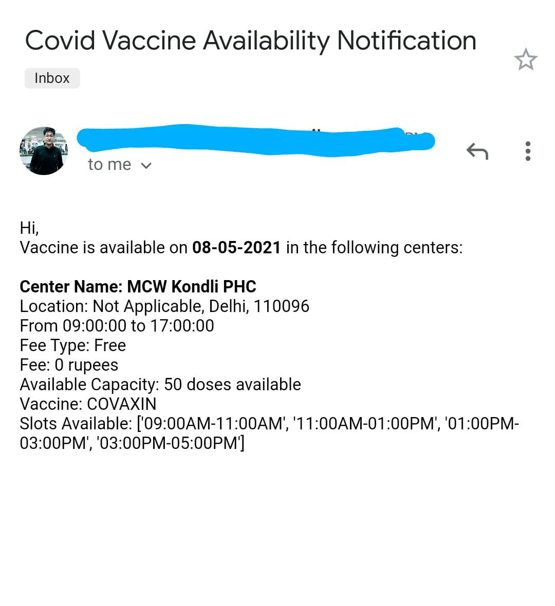

# VaccineNotifier
VaccineNotifier checks the cowin portal periodically to locate vaccination slots to be had to your pin code and on your age. If determined, it'll send you emails periodically till the slots are to be had.

 Steps to run the script:  

Step 1) Enable application access on your gmail with steps given here:
https://support.google.com/accounts/answer/185833?p=InvalidSecondFactor&visit_id=637554658548216477-2576856839&rd=1  
\
Step 2) Enter the details in the file .env, present in the same folder
\
\
Step 3) On your terminal run pip install -r requirements.txt
\
\
Step 4) Now on your terminal run python vaccineAvailabilityNotifier.py
\
\
To close the app do : CTRL+C 

Here's a sample of the resultant emails:

